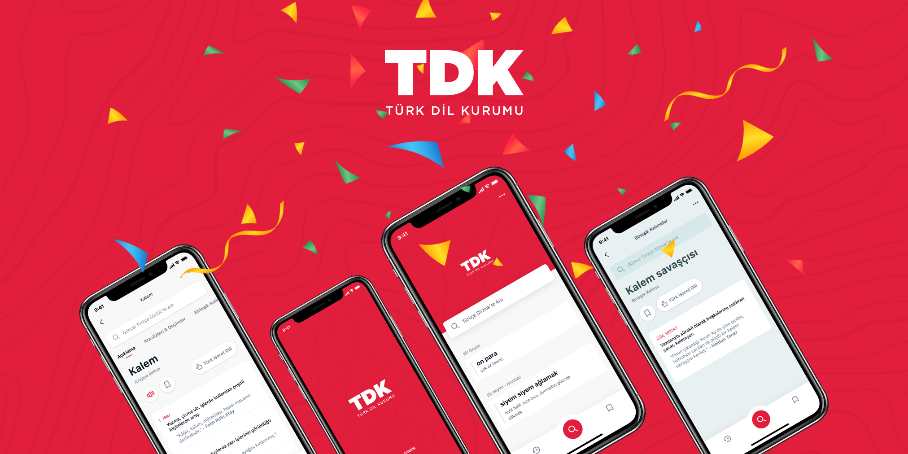

# Turkish Dictionary

This is an unofficial TDK Turkish dictionary mobile app using React Native. The design is based on Feyza Nur Demirci and Şahin Abut's Figma document with some changes.

---
**NOTE:**

The development of this application will continue.

---

[Figma document](https://www.figma.com/file/JqpfJNo6eEJzPpTOEi3Irt/TDK-Redesign?node-id=230%3A1801)

## Application Structure

The icons from the design were exported as svg in `src/icons` folder. Using SVGR, the components for corresponding icons were created in `src/components/icons` folder.

For each page in the application, main components were created in `src/views` folder. 

Created sub-components such as button, card, header, input, search, and tab bar in `src/components` folder to use in the main components.

Also, created `src/utils/theme.js` file to specify sizes, colors, and radii to standardize these values.

Navigation was handled in `src/navigation.js` file. 

## Used Libraries

[React Navigation](https://reactnavigation.org)

[React Native Gesture Handler](https://docs.swmansion.com/react-native-gesture-handler)

[React Native Reanimated](https://docs.swmansion.com/react-native-reanimated)

[react-native-safe-area-context](https://github.com/th3rdwave/react-native-safe-area-context)

[React Native Screens](https://github.com/software-mansion/react-native-screens)

[React Native Splash Screen](https://github.com/crazycodeboy/react-native-splash-screen)

[React Native SVG](https://github.com/react-native-svg/react-native-svg)

[Styled Components](https://styled-components.com)

[Styled System](https://styled-system.com)

[SVGR](https://react-svgr.com)

## Contribute

Step 1: Fork this repository

Step 2: Clone the repository

Step 3: Create a new branch, `your-name`

Step 4: Test your changes before committing

Step 5: Commit & push your changes

Step 6: Submit a pull request to send your changes to the main project to be merged with it

Step 7: Celebrate!